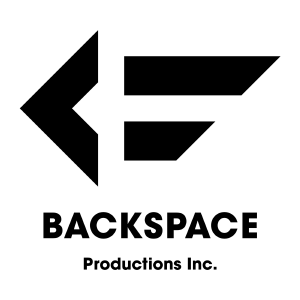
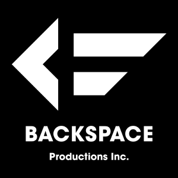
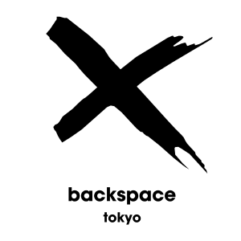
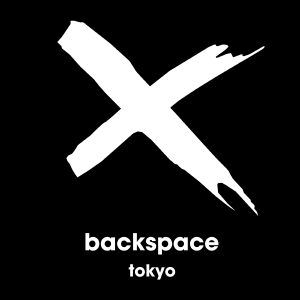
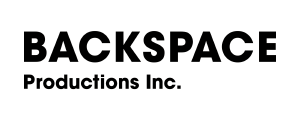
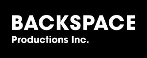
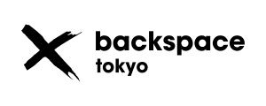
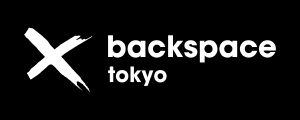

# プレスキット

PDF版は [Webサイト](http://backspace.tokyo/about/) よりダウンロードが出来ます。


* [紹介テキスト](#------)
	+ [Twitterサイズ（110文字）](#twitter----110---)
	+ [2段落サイズ（230文字）](#2------230---)
	+ [原稿用紙1枚サイズ（376文字）](#----1-----376---)
	+ [フルサイズ（626文字）](#------626---)
* [事例画像](#----)
* [ロゴ画像](#----)
	+ [ロゴ画像を使用する際にお読み下さい](#-----------------)
	+ [ロゴ画像 背景色あり](#----------)
	+ [ロゴ画像 背景透過](#---------)

<small><i><a href='http://ecotrust-canada.github.io/markdown-toc/'>Table of contents generated with markdown-toc</a></i></small>


---

## 紹介テキスト

BACKSPACE Productions Inc. / backspacetokyo の紹介テキストです。  
媒体に合わせ、コピーしてご自由にお使いください。

※4サイズありますが、可能な限り フルサイズ の使用を希望します。


### Twitterサイズ（110文字）

```
デジタルアート / ニューメディアアート / DIY精神 を共通の初期衝動に持ったアーティスト・プログラマーが在籍する、オーディオビジュアル・研究開発・ハードウェア設計 / 作成等の分野で活動をするプロダクションチーム。
```


### 2段落サイズ（230文字）

```
デジタルアート / ニューメディアアート / DIY精神 を共通の初期衝動に持ったアーティスト・プログラマーが在籍する、オーディオビジュアル・研究開発・ハードウェア設計 / 作成等の分野で活動をするプロダクションチーム。

プログラミングの高度なスキルをベースにした多様かつ特殊な方面の技術・経験を基に、新しいアイディアやテクノロジーを効果的に使ったプランニング、それらを円滑に実現させるための実装、テクニカルディレクション、コンサルティングを提供します。
```

### 原稿用紙1枚サイズ（376文字）

```
デジタルアート / ニューメディアアート / DIY精神 を共通の初期衝動に持ったアーティスト・プログラマーが在籍する、オーディオビジュアル・研究開発・ハードウェア設計 / 作成等の分野で活動をするプロダクションチーム。

プログラミングの高度なスキルをベースにした多様かつ特殊な方面の技術・経験を基に、各メンバーが個人のアート作品制作展示からインタラクティブなインスタレーション・大規模な音楽公演等のエンターテイメント分野までスケールを問わず活動しています。

集合体でありながら個々の独立した領域を持ち、それぞれが有機的に結びつく制作スタイルを続ける事で常にフレッシュである事を強みとし、新しいアイディアやテクノロジーを効果的に使ったプランニング、それらを円滑に実現させるための実装、テクニカルディレクション、コンサルティングを提供します。
```

### フルサイズ（626文字）

```
デジタルアート / ニューメディアアート / DIY精神 を共通の初期衝動に持ったアーティスト・プログラマー達が在籍する、オーディオビジュアル、研究開発、ハードウェア設計 / 作成等の分野で活動をするプロダクションチーム。

プログラミングの高度なスキルをベースにした多様かつ特殊な方面の技術・経験を基に、各メンバーが個人のアート作品制作展示からインタラクティブなインスタレーション・大規模な音楽公演等のエンターテイメント分野までスケールを問わず活動しています。

BACKSPACE Productions Inc. は、2015年に発足したフリーランスのアーティスト・プログラマーの共同作業場所 backspacetokyo を母体としています。全員がホラクラシーの関係を保ちつつ、前線に出て手を動かすことが我々のモットーです。集合体でありながら個々の独立した領域を持ち、それぞれが有機的に結びつく制作スタイルを続け、常にフレッシュである事を BACKSPACE Productions Inc. / backspacetokyo の強みとしています。

BACKSPACE Productions Inc. は、backspacetokyo のメンバーと社会を繋ぐハブとして機能し、新しいアイディアやテクノロジーを効果的に使ったプランニング、それらを円滑に実現させるための実装、テクニカルディレクション、コンサルティングを提供します。
```

---

## 事例画像


    【ここから事例写真】
    - fragment shadow
    - sonar istanbul
    - fujiko
    - tilted
    - yebizo aistep
    - babymetal
    - audi
    - Veil - millennium parade
    - "millennium parade" Launch Party


---


## ロゴ画像

 
### ロゴ画像を使用する際にお読み下さい
- 以下の幅500pxの画像をクリックすると、幅2000pxの高解像度版が表示されます。ご自身で希望サイズにリサイズされる際は高解像度版をお使い下さい。
- リサイズされる際、拡大はしないで下さい。元の縦横比を保ったまま、縮小して解像度変更をお願い致します。
- ロゴは白（#FFFFFF）と黒（#000000）の2色を使用しています。  
- ロゴ画像は多少の余白を含んでいます。切り詰めずにそのままお使いください。
- 背景透過ロゴを使用される際は配置先の背景色・パターンを考慮し、ロゴ視認性を確保するようお願い致します。


### ロゴ画像 背景色あり

[](assets/Logo_2000x2000/BSP_Logo_Square_Black.png)
[](assets/Logo_2000x2000/BSP_Logo_Square_White.png)
[](assets/Logo_2000x2000/BST_Logo_Square_Black.png)
[](assets/Logo_2000x2000/BST_Logo_Square_White.png)

[](assets/Logo_2000x2000/BSP_Logo_Horiz_Black.png)
[](assets/Logo_2000x2000/BSP_Logo_Horiz_White.png)
[](assets/Logo_2000x2000/BST_Logo_Horiz_Black.png)
[](assets/Logo_2000x2000/BST_Logo_Horiz_White.png)


### ロゴ画像 背景透過

[](assets/Logo_2000x2000/BSP_Logo_Square_Black_Transparent.png)
[](assets/Logo_2000x2000/BSP_Logo_Square_White_Transparent.png)
[](assets/Logo_2000x2000/BST_Logo_Square_Black_Transparent.png)
[](assets/Logo_2000x2000/BST_Logo_Square_White_Transparent.png)

[](assets/Logo_2000x2000/BSP_Logo_Horiz_Black_Transparent.png)
[](assets/Logo_2000x2000/BSP_Logo_Horiz_White_Transparent.png)
[](assets/Logo_2000x2000/BST_Logo_Horiz_Black_Transparent.png)
[](assets/Logo_2000x2000/BST_Logo_Horiz_White_Transparent.png)


